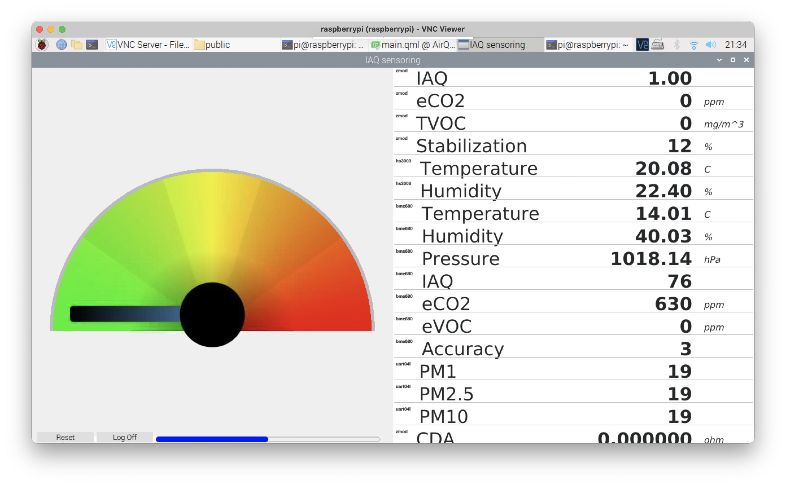
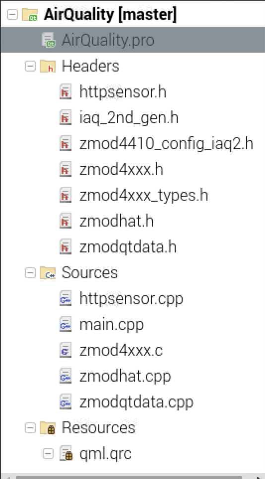
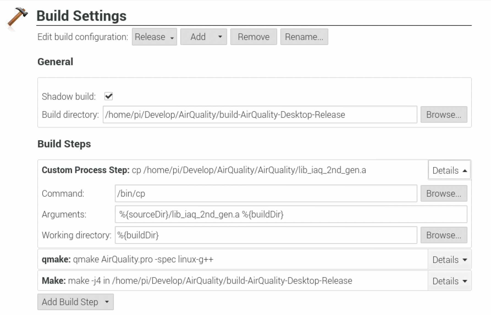

# zmod_airquality
### Demo of ZMOD AirQuality Kit

This as a part of Zmod Air Quality Raspberry as a dash board for elements14 Roadtest.

https://www.element14.com/community/roadTests/2223/l/IDT-ZMOD4410-Indoor-Air-Quality-Raspberry-Pi-HAT

You need to agree with Renesas software licences, approvided and download the firmware and relative code at
Renesas's sites, and import the relative source code and lib to Qt Creator.

Install the raspberry Qt Creator under raspberry (for direct programming on Raspberry device)

  sudo apt-get install qtcreator

Copy those file from Renesas package to Qt project directory and import those files to Qt Creator

***Renesas_ZMOD4410_IAQ_2nd_Gen_Example/ZMOD4410_Firmware/zmod4xxx_example/src/zmod4xxx_types.h***

***Renesas_ZMOD4410_IAQ_2nd_Gen_Example/ZMOD4410_Firmware/zmod4xxx_example/src/zmod4xxx.h***

***Renesas_ZMOD4410_IAQ_2nd_Gen_Example/ZMOD4410_Firmware/zmod4xxx_example/src/zmod4410_config_iaq2.h***

***Renesas_ZMOD4410_IAQ_2nd_Gen_Example/ZMOD4410_Firmware/zmod4xxx_example/src/zmod4xxx.c***

***ZMOD4410_Firmware/gas-algorithm-libraries/iaq_2nd_gen/Raspberry Pi/ARMv8-A/arm-linux-gnueabihf-gcc/lib_iaq_2nd_gen.a***

***ZMOD4410_Firmware/gas-algorithm-libraries/iaq_2nd_gen/Raspberry Pi/ARMv8-A/arm-linux-gnueabihf-gcc/lib_iaq_2nd_gen.h***

#### Setup Projects for added a Custom Proecess Step (upward this step to first)

for script copy the static libs to the build directory (otherwise you need manual copy the .a file to your builded folder):

(Repeat this step under "edit build configuration" select 'debug' and 'profile' )

